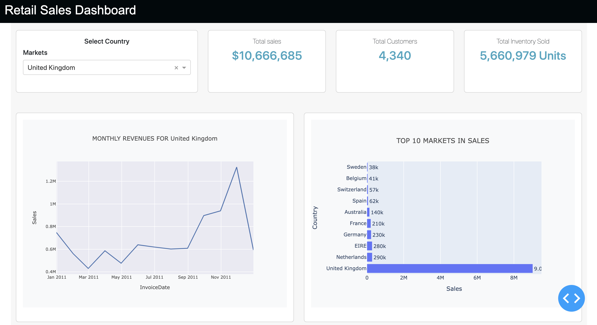

# Retail_Sales_PlotlyDASH_dashboard
Online retail sales for a UK store that provided data for  2010 & 2011. This code helps you understand the basics of data manipulation in Pandas and visualiztion libriries like Plotly Dash. 

